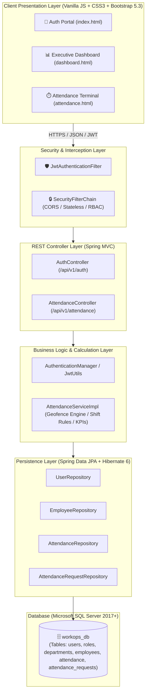
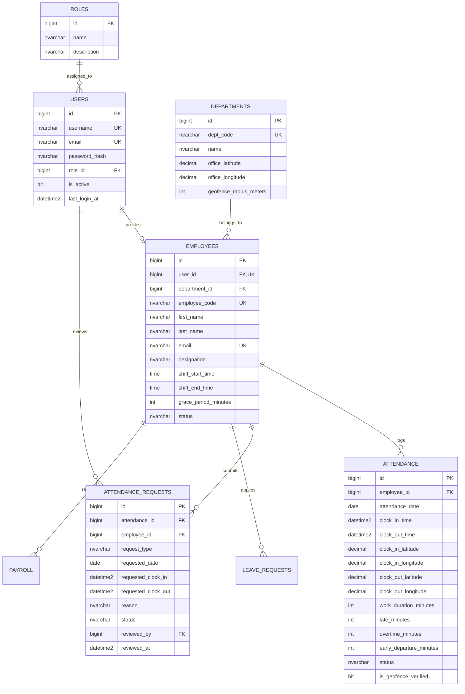

# 🏢 WorkOps — Enterprise Staff Management System

<div align="center">


[](https://spring.io/projects/spring-boot)
[](https://openjdk.org/)
[](https://www.microsoft.com/sql-server)
[](https://jwt.io/)
[](https://getbootstrap.com/)
[](http://localhost:8080/swagger-ui.html)
[](LICENSE)

<p align="center">
  <b>A modern, mission-critical, full-stack enterprise workforce management platform featuring real-time GPS Geofencing, Automated Shift & Overtime Calculation, Role-Based Access Control (RBAC), and Live KPIs.</b>
</p>

[✨ Features](#-core-features) •
[🏛️ Architecture](#-system-architecture) •
[🛠️ Tech Stack](#️-technology-stack) •
[🚀 Quick Start](#-getting-started) •
[🔑 Demo Accounts](#-default-credentials--role-matrix) •
[🌐 API Reference](#-rest-api-documentation) •
[🛰️ Geofence Engine](#️-gps-geofence--shift-calculation-engine)

---

</div>

## 📑 Table of Contents

- [🌟 Overview](#-overview)
- [✨ Core Features](#-core-features)
- [🏛️ System Architecture](#-system-architecture)
- [🛠️ Technology Stack](#️-technology-stack)
- [📂 Project Directory Structure](#-project-directory-structure)
- [🗄️ Database Schema & Relationships](#️-database-schema--relationships)
- [🚀 Getting Started & Setup Guide](#-getting-started--setup-guide)
  - [Prerequisites](#prerequisites)
  - [1. Database Configuration (MS SQL Server)](#1-database-configuration-ms-sql-server)
  - [2. Backend Configuration & Startup](#2-backend-configuration--startup)
  - [3. Frontend Launch](#3-frontend-launch)
- [🔑 Default Credentials & Role Matrix](#-default-credentials--role-matrix)
- [🌐 REST API Documentation](#-rest-api-documentation)
- [🛰️ GPS Geofence & Shift Calculation Engine](#️-gps-geofence--shift-calculation-engine)
- [🖥️ UI / Module Walkthrough](#️-ui--module-walkthrough)
- [🔒 Security & Authentication](#-security--authentication)
- [🧪 Testing & Verification](#-testing--verification)
- [🤝 Contributing & License](#-contributing--license)

---

## 🌟 Overview

**WorkOps** is an enterprise-grade workforce operating platform built with **Java 17 / Spring Boot 3.2.3**, **Microsoft SQL Server**, and a sleek **Dark/Glassmorphism modern web interface**.

It provides high-precision workforce tracking, automated shift rule enforcement, attendance correction lifecycles, and role-gated admin approvals while maintaining sub-millisecond query responses and robust auditing capabilities.

```
┌─────────────────┐       ┌─────────────────┐       ┌────────────────────────┐
│  Modern Web UI  │ ───▶  │  Spring Boot 3  │ ───▶  │  Microsoft SQL Server │
│  (HTML5/CSS3/JS)│ ◀───  │  REST API + JWT │ ◀───  │  (HikariCP + JPA/MSSQL)│
└─────────────────┘       └─────────────────┘       └────────────────────────┘
```

---

## ✨ Core Features

| Feature | Description | Icon |
| :--- | :--- | :---: |
| **🛰️ Geofence Clock-In/Out** | Uses client GPS & Haversine mathematical distance calculation to restrict clock-in strictly within department office boundaries. | 📍 |
| **⏱️ Shift & Late Calculation** | Automatically calculates `LATE_ARRIVAL` (with configurable grace periods), `EARLY_DEPARTURE`, `OVERTIME`, and standard shift work duration. | ⏳ |
| **🔐 Role-Based Access (RBAC)** | Granular permissions supporting `ROLE_ADMIN`, `ROLE_HR`, `ROLE_MANAGER`, `ROLE_STAFF`, and `ROLE_PAYROLL` with stateless JWT Bearer authentication. | 🛡️ |
| **📊 Real-Time Analytics & KPIs** | Live dashboards with automated KPI counters: Total Active Staff, Present, Late Arrivals, On Leave, and Overtime logged. | 📈 |
| **🔄 Attendance Correction Hub** | Complete workflow for missed clock-in/out or dispute resolutions with status transitions (`PENDING`, `APPROVED`, `REJECTED`). | 📝 |
| **🌐 Interactive OpenAPI / Swagger** | Comprehensive API documentation and testing playground out of the box at `/swagger-ui.html`. | 📖 |
| **🎨 Cyberpunk Dark Glassmorphism UI** | Premium interface with CSS variables, radial gradient backdrops, micro-animations, quick demo role switchers, and toast notifications. | 💎 |
| **🛡️ Network Audit Logging** | Captures Client IP, Geolocation Coordinates, Device User-Agent, and timestamps for every attendance event. | 🔍 |

---

## 🏛️ System Architecture



---

## 🛠️ Technology Stack

### 🚀 Backend
- **Framework:** Spring Boot 3.2.3 (Java 17 LTS)
- **Security:** Spring Security 6, JJWT 0.12.5 (HMAC-SHA256 Bearer Tokens)
- **ORM / Persistence:** Spring Data JPA, Hibernate 6, HikariCP Connection Pool
- **Database Driver:** `com.microsoft.sqlserver:mssql-jdbc`
- **Validation:** Hibernate Validator (`jakarta.validation-api`)
- **API Documentation:** SpringDoc OpenAPI 2.3.0 / Swagger UI
- **Code Optimization:** Project Lombok

### 🎨 Frontend
- **Structure:** Semantic HTML5
- **Styling:** Custom Modular CSS3 (Design Tokens, Glassmorphism, Dark Mode Palette) + Bootstrap 5.3 CDN
- **Icons & Typography:** FontAwesome 6 Pro / Free CDN, Google Fonts (Inter)
- **Scripting:** Modular ES6+ JavaScript (`Fetch API`, `Geolocation API`, `localStorage`)

### 🗄️ Database
- **Engine:** Microsoft SQL Server (MS SQL 2017 / 2019 / 2022 or Azure SQL)
- **Dialect:** `org.hibernate.dialect.SQLServerDialect`
- **Features:** Relational Integrity, Foreign Keys with cascading actions, Composite Indexes, Identity Columns.

---

## 📂 Project Directory Structure

```
WorkOps/
│
├── 📁 backend/                             # Spring Boot 3 Java Backend
│   ├── 📄 pom.xml                          # Maven Dependencies & Build Configuration
│   └── 📁 src/main/
│       ├── 📁 java/com/workops/app/
│       │   ├── 📄 WorkOpsApplication.java  # Main Spring Boot Runner
│       │   ├── 📁 config/                  # OpenApiConfig, SecurityConfig, CorsConfig
│       │   ├── 📁 controller/              # AuthController, AttendanceController
│       │   ├── 📁 dto/                     # Request/Response Data Transfer Objects
│       │   ├── 📁 entity/                  # JPA Entities (User, Employee, Attendance, etc.)
│       │   │   └── 📁 enums/               # AttendanceStatus, RequestStatus, EmployeeStatus
│       │   ├── 📁 exception/               # GlobalExceptionHandler, Custom Exceptions
│       │   ├── 📁 repository/             # Spring Data JPA Repositories
│       │   ├── 📁 security/                # JwtUtils, JwtAuthFilter, UserPrincipal
│       │   └── 📁 service/                 # AttendanceService & Business Logic Impl
│       └── 📁 resources/
│           └── 📄 application.yml          # App Properties, DB Config & Geofence Settings
│
├── 📁 database/
│   └── 📄 schema.sql                       # MS SQL Server DDL Schema & Complete Seed Data
│
├── 📁 frontend/                            # Web User Interface
│   ├── 📄 index.html                       # Login & Role Switcher Portal
│   ├── 📄 dashboard.html                   # Executive Overview Dashboard
│   ├── 📁 pages/
│   │   └── 📄 attendance.html              # GPS Clock-In, Timer, History & Correction Hub
│   └── 📁 assets/
│       ├── 📁 css/                         # style.css, dashboard.css, attendance.css
│       └── 📁 js/
│           ├── 📄 api.js                   # API Client, JWT Storage & Auth Interceptors
│           ├── 📄 main.js                  # Global UI Interactions, Notifications & Theme
│           └── 📁 modules/
│               └── 📄 attendance.js        # GPS Coordinates, Live Clock, Table Rendering
│
└── 📄 README.md                            # Comprehensive Documentation
```

---

## 🗄️ Database Schema & Relationships

The database schema is fully defined in [`database/schema.sql`](file:///c:/Users/acer/OneDrive%20-%20Sri%20Lanka%20Institute%20of%20Information%20Technology/Desktop/WorkOps/database/schema.sql).



---

## 🚀 Getting Started & Setup Guide

### Prerequisites
Ensure you have the following installed on your development machine:
- ☕ **JDK 17 or higher** ([Eclipse Temurin](https://adoptium.net/) or [Oracle OpenJDK](https://jdk.java.net/17/))
- 🐘 **Apache Maven 3.8+** (or use included Maven wrapper)
- 🗄️ **Microsoft SQL Server 2017+** (Express, Developer, or Standard edition)
- 🖥️ **SQL Server Management Studio (SSMS)** or Azure Data Studio
- 🌐 Modern Browser (Chrome, Edge, Firefox, Brave) with Geolocation API support

---

### 1. Database Configuration (MS SQL Server)

1. Open **SSMS** and connect to your local SQL Server instance (e.g. `localhost` or `localhost\SQLEXPRESS`).
2. Open [`database/schema.sql`](file:///c:/Users/acer/OneDrive%20-%20Sri%20Lanka%20Institute%20of%20Information%20Technology/Desktop/WorkOps/database/schema.sql) and execute the entire script (`F5` or click **Execute**).
3. This will create:
   - Database: `workops_db`
   - Tables: `roles`, `users`, `departments`, `employees`, `attendance`, `attendance_requests`, `leave_requests`, `payroll`, `performance_reviews`
   - Initial Seed Data with demo users and pre-configured attendance history.

> [!NOTE]
> Ensure **SQL Server Authentication** and **TCP/IP Protocol** (Port 1433) are enabled in SQL Server Configuration Manager.

---

### 2. Backend Configuration & Startup

1. Navigate to [`backend/src/main/resources/application.yml`](file:///c:/Users/acer/OneDrive%20-%20Sri%20Lanka%20Institute%20of%20Information%20Technology/Desktop/WorkOps/backend/src/main/resources/application.yml) and verify your connection credentials:

```yaml
spring:
  datasource:
    url: jdbc:sqlserver://localhost:1433;databaseName=workops_db;encrypt=true;trustServerCertificate=true;
    username: sa
    password: YourStrongPassword123!
    driver-class-name: com.microsoft.sqlserver.jdbc.SQLServerDriver

workops:
  jwt:
    secret: 404E635266556A586E3272357538782F413F4428472B4B6250645367566B5970
    expiration-ms: 86400000 # 24 Hours
  geofence:
    default-latitude: 6.92707900
    default-longitude: 79.86124400
    default-radius-meters: 350
    enforce-verification: false # Set true for strict office geofence rejection
```

2. Open your terminal in the `backend` folder and start the Spring Boot application:

```bash
cd backend
mvn clean spring-boot:run
```

3. Confirm backend is running at:
   - **Base API:** `http://localhost:8080/api/v1`
   - **Swagger UI:** `http://localhost:8080/swagger-ui.html`
   - **OpenAPI JSON:** `http://localhost:8080/api-docs`

---

### 3. Frontend Launch

Since the frontend is built with pure web technologies (HTML5, Vanilla JS, CSS3), you can run it using any local HTTP web server or IDE Live Server.

#### Option A: Using Python built-in HTTP server
```bash
cd frontend
python -m http.server 5500
```
Open your browser at: `http://localhost:5500/index.html`

#### Option B: Using Node `live-server` or `serve`
```bash
npx serve frontend -p 5500
```

#### Option C: VS Code Live Server Extension
- Right-click `frontend/index.html` → Click **"Open with Live Server"**.

---

## 🔑 Default Credentials & Role Matrix

All seed accounts are initialized with the default password: **`Password@123`**

| Role | Username | Full Name | Designation | Permissions & Access Scope |
| :--- | :--- | :--- | :--- | :--- |
| 👑 **Administrator** | `admin` | System Administrator | CTO | Full system control, department settings, user access |
| 🧑‍💼 **HR Manager** | `sarah.hr` | Sarah Connor | Head of HR | Attendance review, leave management, employee directory |
| 👔 **Team Manager** | `alex.manager` | Alex Cross | Engineering Manager | Correction request approvals, team shift oversight |
| 💻 **Staff Member** | `john.doe` | John Doe | Senior Full Stack Engineer | Clock-In/Out, GPS logging, personal records & requests |
| 📈 **Marketing Staff** | `emma.watson`| Emma Watson | Growth Specialist | Flexible shift timing (09:00 - 18:00), shift tracking |
| 💰 **Payroll Officer** | `david.fin` | David Beck | Payroll Controller | Salary computation, overtime calculation & audit |

> [!TIP]
> On the login page ([`frontend/index.html`](file:///c:/Users/acer/OneDrive%20-%20Sri%20Lanka%20Institute%20of%20Information%20Technology/Desktop/WorkOps/frontend/index.html)), you can click any of the **Quick Demo Role Pills** (`Admin`, `HR Lead`, `Manager`, `Engineer`, `Payroll`) to autofill credentials instantly!

---

## 🌐 REST API Documentation

### 🔐 Authentication Endpoints (`/api/v1/auth`)

| Method | Endpoint | Description | Auth Required |
| :--- | :--- | :--- | :---: |
| `POST` | `/api/v1/auth/login` | Authenticates user with username & password, returns JWT token + profile | ❌ Public |
| `GET` | `/api/v1/auth/me` | Retrieves profile of currently authenticated user session | ✅ Bearer |


---

### ⏱️ Attendance Endpoints (`/api/v1/attendance`)

| Method | Endpoint | Description | Permitted Roles |
| :--- | :--- | :--- | :--- |
| `POST` | `/api/v1/attendance/clock-in` | Record clock-in with GPS coordinates & shift status computation | Any Authenticated |
| `POST` | `/api/v1/attendance/clock-out` | Record clock-out, calculate duration, overtime & early departures | Any Authenticated |
| `GET` | `/api/v1/attendance/status/today` | Fetch active shift timer, office geofence data & current clock status | Any Authenticated |
| `GET` | `/api/v1/attendance/records` | Filter attendance logs by date range, department, status & employee code | All (Scoped) |
| `GET` | `/api/v1/attendance/kpis` | Real-time aggregate KPI metrics (Present, Late, Leaves, Overtime) | All |
| `POST` | `/api/v1/attendance/corrections` | Submit correction request for missed clock-in/out or disputes | Staff / Manager |
| `GET` | `/api/v1/attendance/corrections` | List correction requests (filterable by `PENDING`, `APPROVED`, etc.) | HR / Manager / Admin |
| `PUT` | `/api/v1/attendance/corrections/{id}/review` | Approve or Reject a correction request with reviewer notes | `ADMIN`, `HR`, `MANAGER` |

---

## 🛰️ GPS Geofence & Shift Calculation Engine

The attendance engine performs real-time algorithmic calculations on every punch event:

### 1. Haversine Great-Circle Distance
Calculates exact distance in meters between the employee's browser device coordinates $(\phi_1, \lambda_1)$ and their department's registered office coordinates $(\phi_2, \lambda_2)$:

$$d = 2r \arcsin \left( \sqrt{\sin^2\left(\frac{\Delta\phi}{2}\right) + \cos(\phi_1)\cos(\phi_2)\sin^2\left(\frac{\Delta\lambda}{2}\right)} \right)$$

- If $d \le \text{geofence\_radius\_meters}$, the attendance is marked as `is_geofence_verified = 1`.
- If $d > \text{radius}$ and `enforce-verification: true`, clock-in is rejected with `GeofenceException`.

### 2. Status & Shift Grace Period Engine
- **Grace Period:** Configurable per employee (default: 15 minutes).
- **On-Time:** $\text{Clock-In Time} \le \text{Shift Start} + \text{Grace Period} \implies \text{PRESENT}$.
- **Late Arrival:** $\text{Clock-In Time} > \text{Shift Start} + \text{Grace Period} \implies \text{LATE\_ARRIVAL}$.
- **Work Duration:** Calculated in minutes between Clock-In and Clock-Out.
- **Overtime:** Calculated when shift duration exceeds standard shift hours ($\text{Duration} > 480 \text{ mins}$).
- **Early Departure:** Triggered if employee clocks out prior to scheduled shift end time.

---

## 🖥️ UI / Module Walkthrough

### 1. 🔑 Cyberpunk Authentication Portal (`index.html`)
- Glassmorphism dark container with ambient gradient lighting.
- Role pills for single-click credential population.
- JWT storage in `localStorage` with automatic redirect to dashboard upon successful verification.

### 2. 📊 Executive Operations Dashboard (`dashboard.html`)
- Overview KPI metric cards (Total Staff, Present Rate, Avg Work Hours, Pending Reviews).
- Quick Action shortcut buttons (Launch Attendance Terminal, Apply Leave, View Reports).
- Responsive collapsible sidebar with active page indicators.

### 3. ⏱️ Live Attendance Terminal (`pages/attendance.html`)
- **Live Digital Shift Clock:** Synchronized with local time down to the second.
- **GPS Radial Geofence Radar:** Live visual feedback displaying distance to office boundary.
- **Dynamic Clock-In / Clock-Out Buttons:** State-aware button toggle depending on daily shift status.
- **Attendance History Data Grid:** Search, filter by department, date range, and export-ready status badges.
- **Interactive Correction Modal:** Staff can request punch adjustments with reason and evidence notes.

---

## 🔒 Security & Authentication

- **Stateless Session Management:** No server-side sessions; all requests are authenticated via `Bearer <JWT_TOKEN>`.
- **BCrypt Password Encryption:** All user passwords hashed with BCrypt (Strength 10) in SQL Server.
- **Role-Based Authority Enforcement:** Method-level security annotations (`@PreAuthorize("hasAnyRole(...)")`) guard privileged review routes.
- **CORS Protection:** Configured to allow secure development origins while filtering unauthorized requests.
- **Audit Logging:** User IP address and User-Agent are automatically extracted from `HttpServletRequest` and stored for compliance.

---

## 🧪 Testing & Verification

### Running Automated Backend Tests
```bash
cd backend
mvn test
```

